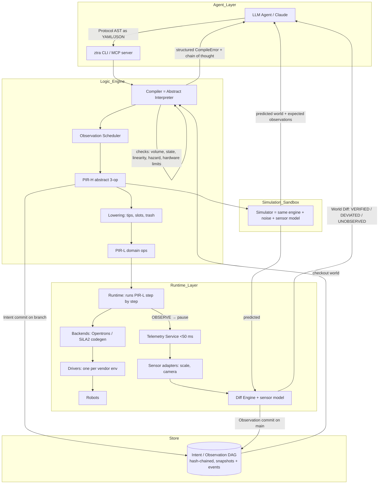

# ARCHITECTURE.md: ztra (Physical Operating System)

> Revised 2026-08-24 after the `prototype/unknowns` round. Every design decision marked **[U*]** is backed by
> an experiment in [PROTOTYPE_FINDINGS.md](PROTOTYPE_FINDINGS.md); read that for the evidence.

## 1. Overview

**ztra** (pronounced _Zetra_) is an Agent-Native Development Environment (ANDE) designed to bridge the gap between Large Language Model (LLM) reasoning and physical world execution.

Unlike traditional lab automation that relies on static scripts, **ztra** treats the physical world as a version-controlled, programmable substrate. It provides the "Harness" (Git-like state management, compilers, and linters) necessary for agents to iterate, debug, and execute physical tasks with software-level rigor.

---

## Glossary

Standard names where a standard name fits; invented names only for ideas that are new here.

| Term | Meaning |
|---|---|
| **World model** | The versioned description of the lab: inventory, deck, hardware. The source of truth. |
| **Protocol** | The experiment, written as data (YAML/JSON AST). The compiler's input. |
| **Compiler** | Checks a protocol by running it against a copy of the world model (abstract interpretation) and produces PIR-H. |
| **PIR-H** | The compiler's intermediate representation: vendor-neutral, in the protocol's vocabulary. What the compiler, store, simulator and diff engine reason about. |
| **Lowering** | The pass from PIR-H to PIR-L: resolves names through the linker, allocates tips and trash, splits volumes. |
| **Linker** | The table in `Deck.yaml` that maps an entity name to a physical address (labware, slot, well). |
| **PIR-L** | The target-level representation: the steps a liquid handler actually performs (`pick_up_tip`, `aspirate`, …). One dialect per domain. |
| **Runtime** | Executes a PIR-L program step by step: dispatches to a backend/driver, pauses on `observe`, decides branches from telemetry. |
| **Backend** | Code generation from PIR-L to a vendor's language (Opentrons Python, SiLA2 calls). One per vendor. |
| **Driver** | The vendor-side process that talks to the robot, one per vendor package/environment. |
| **Sensor adapter** | The piece of the Telemetry Service that speaks to one instrument (scale, camera). |
| **Telemetry Service** | Separate process that owns the sensors, meets the latency budget, and feeds the diff engine. |
| **Store** | Append-only, hash-chained history of intents and observations with branches. The component behind the "Vertical Git" idea. |
| **Intent / Observation commit** | A predicted world (from a compile) / an observed world (from a run). Only `main` holds observations. |
| **World diff** | The report comparing predicted and observed worlds, with a verdict per observed entity. |

---

## 2. Core Philosophy

1. **Physical State as Code.** The laboratory state is a versioned, append-only repository.
2. **Linear Resources, Enforced by Execution.** Physical entities (reagents, tips, plates) are non-clonable and carry state (`Frozen`/`Thawed`, `consumed`). These guarantees are delivered by *abstractly executing* the protocol against the world model — not by a syntactic type system. **[U1]**
3. **Only `main` Is Real.** Branches hold hypotheses (intents). Reality is a single linear history; execution is a fast-forward of `main`, never a merge. **[U4]**
4. **Simulation-First Execution.** No physical command is issued without compiling and simulating. Compiler and simulator are the same engine. **[U1, U5]**
5. **Observation Is Budgeted.** You only know what you measured. The compiler schedules `OBSERVE` checkpoints, and the World Diff reports per-entity verdicts with sensor uncertainty, never a bare predicted/observed table. **[U5]**

---

## 3. System Architecture

---

## 4. Components

### 4.1 The World Model (Source of Truth)

Versioned YAML, checked out from the Store (§4.5). Schema reference: [WORLD_MODEL.md](WORLD_MODEL.md).

- **Inventory.yaml** — reagents with an MSDS hazard class (`Inert | Acid | Base | Oxidizer | …`); vials with `reagent`, `volume_ul`, `state` (`Frozen | Thawed`), `freeze_thaw_cycles`, `consumed`; plates with per-well contents and `max_ul` from the labware definition.
- **Deck.yaml** — labware placed on slots, **tip racks and their occupancy**, and the **linker table** `entity → (labware, slot, well)`. Without this, lowering cannot resolve `V_water`. **[U3]**
- **Hardware.yaml** — robot model, pipettes (`min_ul`, `max_ul`, mount, channels), the **labware catalog** (source of CON-2), and the **sensor model**: for each sensor, which entities it can observe and its noise σ (e.g. scale: whole-plate mass, σ = 0.5 mg; camera: wells in column 1, σ = 5 µL). **[U5]**
- **Protocol.ztra** — the experiment, as a YAML/JSON document of the Protocol AST (§4.2).

### 4.2 The Protocol Language

**Protocol = data, not a DSL.** **[U2]** Agents emit structured output natively; a bespoke syntax adds a parser without adding safety. A DSL may be layered on later.

Steps (v0.1): `thaw`, `transfer {from, to, volume_ul}`, `mix`, `repeat {times, body}`, `for_wells {wells, as, body}` (a static loop over listed wells, `$name` in `well:` fields), `observe {sensor, label}`, `if_observed {observation, condition, then, otherwise}`.

Language rules — **the protocol must be total and bounded** **[U1]**:

- Loop counts are static (`repeat {times}`, `for_wells {wells}`); no unbounded `while`.
- Branching is allowed only on the result of an `Observe` taken earlier on the same path. The compiler is **path-sensitive**: it forks the world at each branch and checks the rest of the protocol on every path, so prediction is a *set* of outcomes (one per path, tagged with its branch conditions). A step that is invalid on any path is a compile error naming that path. Paths are capped (64). Reference: [PROTOCOL.md](PROTOCOL.md).
- No arithmetic on observed values in v0.1.

### 4.3 The Compiler

**The compiler is an abstract interpreter.** **[U1]** It walks the AST against a cloned world, applies each step's transition, and checks preconditions at every step. "Stateful types" (`Thawed<Reagent>`) and "linear types" (use-once) are state fields plus per-op preconditions; no generics or type inference are involved.

Checks (each with a stable error code):

| Code | Physical law | Source |
|---|---|---|
| `E_VOLUME` | cannot aspirate more than is present | FR-2.2 |
| `E_OVERFLOW` | well capacity from labware definition | CON-2 |
| `E_STATE` | operation requires a reagent state (e.g. Thawed) | FR-2.1 |
| `E_CONSUMED` | a consumed linear resource cannot be reused | FR-1.3 |
| `E_HAZARD` | MSDS incompatibility in the destination mixture | CON-3 |
| `E_PIPETTE_RANGE` / `E_DECK` | hardware limits, slot occupancy, clearance | FR-2.3 |
| `E_TIPS` | tip rack exhausted | FR-2.3 |
| `E_UNKNOWN_ENTITY` / `E_COORDINATE` / `E_UNKNOWN_SENSOR` / `E_UNKNOWN_OBSERVATION` | reference resolution | FR-2.4 |
| `E_LOOP_BOUND` / `E_TOO_MANY_PATHS` / `E_MIXTURE_IN_VIAL` | language rules | FR-2.6 |

Properties:

- **Agent-readable errors** (FR-2.4, NFR-5.1): `code, step_path, iterations, branch_path, physical_law, resource, coordinate, expected, actual, hint, chain_of_thought`. `step_path` is the AST path; `iterations` has one entry per enclosing `repeat`; `branch_path` names the branch decisions that lead to the error.
- **Deterministic** (NFR-4.1): ordered maps, no wall-clock, identical input → identical PIR and world hash.
- **Entropy tracking**: freeze–thaw cycles and time-at-temperature are ordinary world fields updated by transitions.
- **Observation-scheduling pass** **[U5]**: after checking, the compiler inserts `OBSERVE` checkpoints according to a verification budget (e.g. "weigh after every N transfers", "camera-check every destination in column 1"). More checkpoints → slower run, finer localization of failures. The budget is a compile option chosen by the agent or a policy.
- Cost model (NFR-5.2) is a fold over the same walk: time per op, reagent consumed, tips consumed.

### 4.4 The Physical Intermediate Representation (PIR)

**PIR has two levels.** **[U3]** The vendor's own simulator rejects code generated from the abstract form alone (`TipNotAttachedError`) and accepts it once tips, slots and trash are allocated.

- **PIR-H (abstract)** — the universal ISA from the original design; what the compiler, store and diff engine reason about:
  - `MOVE <entity> TO <location>` (not emitted by v0.1 liquid handling)
  - `TRANSFORM <inputs> BY <op> INTO <outputs>`
  - `OBSERVE <property> OF <entity>`
  - `BRANCH ON <observation> <condition> THEN [...] ELSE [...]` — structural; a flat list cannot express a data-dependent choice, and lowering needs to know where the robot pauses for a decision.
  Every op carries an `origin` (AST path + loop iterations) so errors and diffs point back at the protocol.
- **PIR-L (domain: liquid handling)** — what the runtime and backends consume: `PickUpTip`, `Aspirate`, `Dispense`, `Mix`, `DropTip`, `Observe`, each carrying resolved `(labware, well)`.
- **Lowering H → L** allocates hardware-specific linear resources (tips from racks, trash), resolves entities through the linker table, and splits transfers that exceed pipette range. Lowering is deterministic and runs *before* commit so the store records exactly what will be sent. Reference: [LOWERING.md](LOWERING.md).
- **Segments.** A vendor protocol cannot change course mid-run on an external reading, so a program with `BRANCH` lowers to a **tree of segments**: straight-line PIR-L that ends in `halt` or `decide`. The runtime runs one segment per vendor run and picks the next from telemetry. What follows a branch is copied into each arm so tip wells stay exact on every path.

### 4.5 The Store

Append-only, hash-chained DAG — the component behind the "Vertical Git" idea. **[U4]** Git-like vocabulary; not git.

- **Commit kinds**
  - `Intent` — protocol steps, PIR-H/PIR-L, and the **predicted** world snapshot. Allowed on any branch.
  - `Observation` — telemetry and the **observed** world snapshot. Allowed **only on `main`**.
- **Branch** — a pointer into the DAG. Resources consumed on a branch are consumed only in that lineage's prediction (FR-1.2, FR-1.3).
- **Execute = fast-forward.** A branch can be executed only if its base is the current `main` head. Execution appends the branch's intents to `main`, then an `Observation` commit whose world is the **observed** state (not the predicted one).
- **Rebase = recompile.** A branch whose base is stale is replayed against the new `main`; linear-resource conflicts surface as ordinary `CompileError`s. **There is no 3-way merge.**
- **Storage** — both *events* (the protocol document and lowered program, for provenance and rebase) and *snapshots* (world hash → world, for O(1) checkout). Every object is a JSON file named by its SHA-256 (`.ztra/objects/`), heads are `.ztra/refs/<branch>`; a commit's hash covers its parent, and `verify` recomputes the chain (NFR-3.2). Reference: [STORE.md](STORE.md).
- **No planning past an unresolved reading.** An intent that branches on an observation has several predicted outcomes; nothing can be committed on top of it until it is executed and the outcome is known.
- Real git's merge semantics are wrong for this domain, so this is a small purpose-built store.

### 4.6 The Simulator (The Sandbox)

**The same engine as the compiler** plus two inputs: a seeded noise model (FR-3.2: dispense drift, per-dispense jitter, transfer failure rate) and the sensor model from `Hardware.yaml`. Output is the predicted world **and the expected reading at each scheduled `OBSERVE`**, with the spread across seeds, which is what the Diff Engine compares against. Reference: [SIMULATION.md](SIMULATION.md).

### 4.7 Runtime, Backends, Drivers & Telemetry

- **Runtime** executes a PIR-L program: hands each segment to a driver, pauses at `OBSERVE`, decides `BRANCH` from telemetry, and records the observation — completed or aborted. It is the only component that dispatches physical work, and only after an approver says yes and only once per intent (the Store's fast-forward rule plus a run journal). Reference: [RUNTIME.md](RUNTIME.md). Today it runs on a **fake driver** with simulated sensors; no hardware exists.
- **Backends** generate vendor code from PIR-L, one file per segment (Opentrons Python today; SiLA2 later). Every backend is validated by running its output through the vendor simulator (`opentrons_simulate`), gated in tests by `ZTRA_OT_SIM_OT2` / `ZTRA_OT_SIM_FLEX`.
- **Drivers** are the vendor-side processes. Opentrons OT-2 and Flex need **separate Python environments** (`opentrons<9` vs `≥9`; the 9.x package refuses OT-2 protocols). **[U3]**
- **`OBSERVE` is not a robot command.** On Opentrons it lowers to `pause`; the reading comes from the **Telemetry Service**, a separate process that owns the **sensor adapters**, meets NFR-4.2 (<50 ms), and streams over WebSockets/MQTT. It never crosses the core↔driver CLI boundary of §6.
- **Safety** (NFR-3.1): E-stop interlocks live in the Telemetry Service / driver layer, keyed on the safe operating envelope from `Hardware.yaml`.

### 4.8 The Diff Engine

Compares the simulator's expected observations with the telemetry actually received. **[U5]**

- Per observed entity: `predicted`, `observed`, `delta`, `sigma`, verdict `VERIFIED_WITHIN_SENSOR_NOISE | DEVIATED | UNOBSERVED`.
- Per run: aggregate verdicts (e.g. plate mass) and a classification `systematic` (aggregate off, no entity off — a calibration signal) vs `localized` (a specific entity off — a protocol/hardware failure).
- Whether a deviation **can be localized** depends entirely on the observation schedule chosen at compile time; the report says so explicitly.

---

## 5. The Workflow

1. **Checkout** the `main` world.
2. **Branch** a hypothesis.
3. **Write** `Protocol.ztra` (AST as YAML/JSON).
4. **Compile** → PIR-H, cost estimate, scheduled observations; or a structured `CompileError` and the agent iterates.
5. **Simulate** (N seeds) → predicted world + expected observations.
6. **Commit Intent** on the branch (includes lowered PIR-L).
7. **Execute** — only as a fast-forward of `main`; otherwise **rebase** (recompile) first. The runtime executes PIR-L through a backend and driver; `OBSERVE` steps pull readings from the Telemetry Service.
8. **Diff** → World Diff report; an `Observation` commit lands on `main` with the observed state.
   - Verified: done.
   - Deviated/systematic: flag calibration; done.
   - Deviated/localized: agent debug loop on a new branch from the new `main`.

---

## 6. Technology Stack & Boundaries

- **Core:** Python 3.12 with pydantic v2 models (schema as types, unknown fields rejected) and `mypy --strict`. Decided 2026-08-25: one language keeps the tech minimal — the core is pure data transformation and the vendor ecosystem is Python. The process boundary below stays, so a hot component could be rewritten in a faster language later without touching the rest.
- **Core ↔ driver boundary: CLI with JSON on stdout.** **[U6]** The compiler is stateless per call. The `opentrons` packages pin dependencies aggressively and differ per robot generation, so drivers live in their own venvs and the core never imports them; it talks to them through files and processes.
- **Agent Interface:** MCP server (IF-2.1) wrapping the core in-process with the Python MCP SDK (`ztra-mcp`, stdio; see [MCP.md](MCP.md)); REST/gRPC (IF-2.2) later.
- **Drivers:** Python, one venv per vendor package (Opentrons 8.x, Opentrons 9.x, SiLA2). Vendor facts we rely on: [OPENTRONS_NOTES.md](OPENTRONS_NOTES.md).
- **Telemetry Service:** separate process; WebSockets/MQTT.
- **Configuration:** YAML. Protocol Buffers only if the gRPC surface materialises.

---

## 7. v0.1 Scope Decisions (deviations from REQUIREMENTS.md)

- **FR-2.1 wording.** "Physical type checking" is implemented as state predicates under abstract interpretation, not a generic type system. Guarantees unchanged. **[U1]**
- **FR-3.3 kinematic collision detection** is reduced to **static deck checks** for v0.1: slot occupancy, labware height vs pipette clearance, tip length vs labware depth. Opentrons firmware already refuses out-of-bounds moves on a fixed slot grid. True trajectory kinematics returns to scope with a non-slotted robot (Hamilton, arm). **[U7]**
- **FR-4.3 World Diff** is reported at the granularity of the observation schedule, with explicit `UNOBSERVED` verdicts. A per-well diff is only promised where a sensor covers the well. **[U5]**
- **FR-1.2 branching** has no merge operation. **[U4]**

## 8. Open Questions

- Real σ and latency of the scale/camera we own (sets diff thresholds and the default verification budget).
- Agent ergonomics of the pessimistic join for `IfObserved`; may need a "declare expected branch" hint.
- Mixture semantics inside a well (the prototype used "dominant reagent"); concentrations need a proper model.
- Mapping of SiLA2 instruments onto PIR-L and `OBSERVE`.

## 9. Build Order for v0.1

1. World model schema (Inventory, Deck incl. tip racks + linker table, Hardware incl. sensor model).
2. Protocol AST + abstract-interpreting compiler → PIR-H + structured errors.
3. PIR-H → PIR-L lowering + Opentrons backend, vendor-simulator-validated in CI (8.x and 9.x).
4. Store: Intent/Observation DAG, fast-forward execute, rebase.
5. Simulator + observation scheduling + diff engine.
6. MCP server over the CLI.
7. Runtime, Telemetry Service with sensor adapters, E-stop — done on a fake driver. Real drivers/adapters and the first robot run wait for hardware.

---

## 10. Future Scaling: "The Universal Physical ISA"

While version 0.1 focuses on **96-well plate liquid handling** (the "byte array" of biology), PIR-H is designed to scale, with a new PIR-L per domain:

- **Chemistry:** Reaction temperature and pressure state-tracking.
- **Manufacturing:** Tolerance-aware part assembly.
- **Logistics:** Coordinate-based inventory flow.

**ztra: If you can't version it, you can't automate it.**
