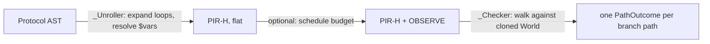

> [!WARNING]
> **Nexus desync** — explainer says the compiler "works in two passes" (`_Unroller` then `_Checker`); `compile()` also validates the world up front and, when a budget is given, runs `schedule()` between unrolling and checking to insert observe steps — a third, conditional pass the "two passes" framing omits.

# compiler.py

The compiler is an abstract interpreter: it runs the protocol against a cloned copy of the
world model instead of the real one, so every physical law (volume, overflow, hazard, tip
supply, ...) gets checked before anything is sent to a robot.

It works in two passes. `_Unroller` walks the Protocol AST once and flattens it into PIR-H:
`repeat` and `for_wells`/`for_each` loops are fully expanded (loop counts must be static, so
this always terminates), `$variable` references are resolved against whatever loop scope is
currently bound, and 8-channel steps addressed by column get expanded into eight per-well ops
sharing a `gang` id. Every emitted op carries an `Origin` — the AST path, loop iteration
numbers, and current bindings — so a later error or diff can point back at the exact protocol
line that produced it.

`_Checker` then walks the unrolled PIR-H against a `World.clone()`, applying each op's effect
(draining a vial, filling a well, consuming a tip, etc.) and raising a `CompileError` the
moment a precondition fails. The interesting part is `if_observed`: the checker can't know at
compile time which way a real sensor reading will go, so at a `Branch` it forks the world state
and checks *both* arms, recursively, producing one `PathOutcome` per reachable combination of
branch decisions (capped at 64 paths via `E_TOO_MANY_PATHS`, since each branch doubles the
count). A protocol with no branches has exactly one path.

Two things ride along with each path as it's checked: a running `Cost` (time estimate, tips
used, reagent drawn — the numbers `preflight.py` and the CLI's cost report surface) and a
`trace` of human-readable strings describing each step's effect, which becomes the
`chain_of_thought` attached to any error raised later on that path.

Tip handling is the other source of complexity: a `with_tip` scope shares one tip across
several steps, so the checker tracks which pipette and source location a named tip is
committed to and raises `E_TIP_CONTAMINATION` if a later step under the same name tries to
draw from a different place. 8-channel ("gang") steps reuse this machinery — channel 0 picks
up a whole column of tips and the other seven channels ride along on that pickup.
