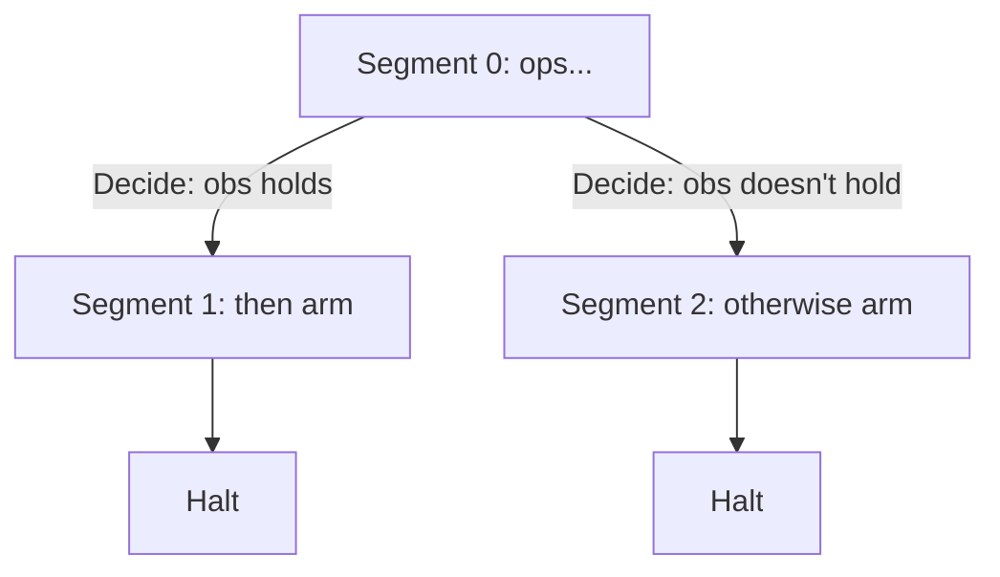

> [!WARNING]
> **Nexus desync** — explainer says "each branch arm gets `path.copy()`'d state"; the code only copies the path for the `then` arm (`self.build(path.copy(), op.then, inner)`) and passes the original, uncopied path to the `otherwise` arm (`self.build(path, op.otherwise, inner)`).

# lower.py

Lowering turns PIR-H (abstract, vendor-neutral) into PIR-L (concrete robot ops) and resolves
everything the compiler left symbolic: entity names become `(labware, well)` addresses via the
Deck.yaml linker table, tips get actually allocated from specific rack positions, and any
transfer volume too large for one pipette cycle gets split into multiple aspirate/dispense
pairs.

The one structural wrinkle is `Branch`. A real liquid handler can't pause mid-run, check a
sensor reading, and change course — the vendor driver just runs a fixed sequence. So instead of
lowering a branch to a conditional, `_Lowerer.build()` produces a **tree of segments**: each
`Segment` is a straight-line run of PIR-L ops ending either in `Halt` or in `Decide` (which
segment to jump to for each branch outcome). The runtime is what actually walks this tree at
execution time, sending one segment to the driver, waiting for telemetry, then picking the next
segment. Because each branch arm gets `path.copy()`'d state, the two arms don't interfere —
each records its own tip and deck bookkeeping, so tip well assignments come out exact on every
path rather than being shared (and potentially wrong) across arms.

Tip bookkeeping mirrors the compiler's: outside a `with_tip` scope, every step gets a fresh
tip and drops it immediately after; inside one, the first step in the scope picks up a tip and
it's reused (tracked via `path.held`/`path.named`) until the scope closes. 8-channel steps ride
the same path but request/release a whole tip-rack column instead of a single well.
